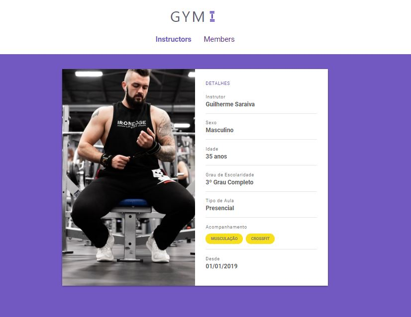

<h2 align="center"> Em construção ... </h2>

<p align="center">
   
</p> 


## Sobre

**Gym_Maneger** foi um projeto criado no **Bootcamp Launchbase** que permite gestão de uma academia completa.


## Ferramentas

O projeto foi desenvolvido utilizando as seguintes tecnologias:

- **HTML5**
- **CSS3**
- **JavaScript**
- **Node.js**
- **Browser-sync**


## Para iniciar

```bash

    # clone repository
    $ git clone https://github.com/ViniciusMDuarte/Gym_Manager.git

    # Enter directory
    $ cd Gym_Manager

    # Install package
    $ npm install
    
    # Start the project
    $ npm start

    # View browser
    $ http://localhost:5000/
```
